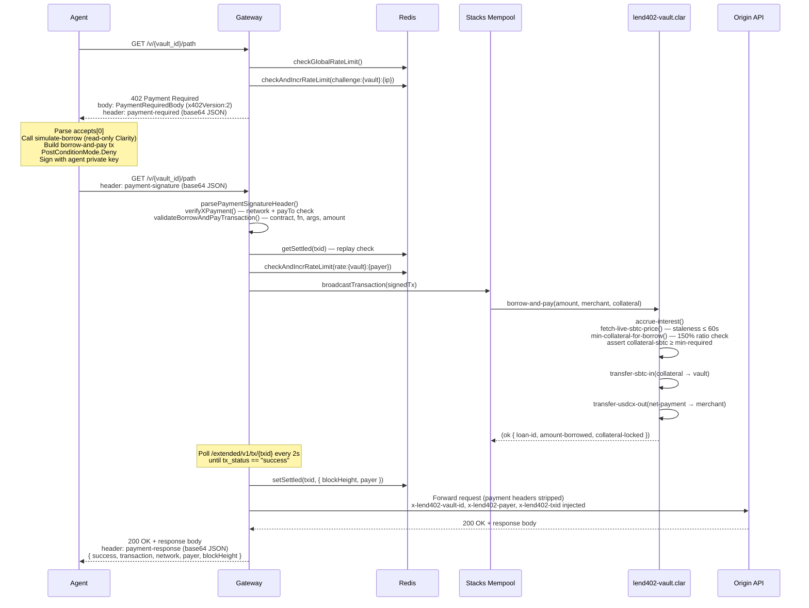

# Lend402

Lend402 is the Stacks-native payment and credit rail for agentic APIs.

The fastest way to understand it is: think Stripe for paid agent calls, except the request itself is the payment surface. A provider wraps an API behind x402, an agent presents a signed Stacks payment, and Lend402 can finance that request just in time with `sBTC` collateral and `USDCx` liquidity before the origin response is released.

## What It Does

- Turns any HTTPS endpoint into a paid Stacks-native x402 endpoint.
- Lets an agent hold `sBTC`, borrow exactly the `USDCx` needed for a request, and settle that request on-chain in a single flow.
- Gives providers a dashboard to register endpoints, share wrapped URLs, monitor calls, and track `USDCx` revenue.
- Persists vault and call data in Postgres and uses Redis for rate limiting and settlement idempotency.

## Why It Exists

Most paid APIs still assume a human operator, a credit card, and an API key. That breaks down for autonomous software.

AI agents can fetch data and take actions, but they still need:

- per-request payment instead of monthly billing
- a credit mechanism so they do not need to keep every asset pre-funded
- a settlement rail that is verifiable, programmable, and Bitcoin-aligned

Lend402 addresses that by combining x402, Clarity, `sBTC`, and `USDCx` on Stacks.

## End-to-End Flow

1. A provider registers an origin API and sets a `USDCx` price per call.
2. Lend402 exposes a wrapped `/v/{vault_id}/...` endpoint.
3. An agent requests that endpoint and receives an x402 `402 Payment Required` challenge.
4. The agent SDK runs `simulate-borrow`, or falls back to a live DIA read-only quote if the vault cache is cold, then builds `borrow-and-pay`, signs the Stacks transaction, and retries with the official x402 `payment-signature` header.
5. The gateway validates the payload, settles the signed transaction on Stacks, records the call, and forwards the request to the provider.
6. The provider response is returned with a `payment-response` receipt, and the UI links the payment to Hiro Explorer.

## Architecture

1. `contracts/lend402-vault.clar`
   Clarity vault contract for `borrow-and-pay`, LP liquidity, collateral tracking, cached DIA oracle reads for quote paths, and `sBTC`/`USDCx` settlement.

2. `server/agent-client.ts`
   Stacks agent SDK that intercepts HTTP `402`, runs `simulate-borrow`, falls back to a live DIA quote when needed, builds a `borrow-and-pay` contract call with `PostConditionMode.Deny`, signs it, encodes an official x402 `payment-signature` payload, and retries the request.

3. `src/app/api/v/[vault_id]/[...path]/route.ts`
   Next.js gateway route that issues x402 challenges, validates signed payment payloads, settles the Stacks transaction, records the call in Postgres, rate-limits traffic with Redis, and proxies the paid request to the provider origin.

4. `src/app/vault/*`
   Provider surfaces for vault registration, wrapped URL creation, dashboard authentication, and recent paid-call visibility.

5. `src/app/api/internal/refresh-price-cache/route.ts`
   Authenticated internal route that submits the on-chain `refresh-price-cache` call from a dedicated relayer wallet so the vault's cached DIA quote can stay warm.

6. `database/migrations/*`
   Postgres schema and migration history for vaults, calls, counters, and PRD-aligned columns.

## x402 V2 Compliance Matrix

Every requirement from the x402 V2 specification is mapped to its implementation below.

| Requirement | Spec | Implementation | Status |
|---|---|---|---|
| **HTTP challenge header** | `payment-required` | `X402_HEADERS.PAYMENT_REQUIRED` from `x402-stacks` pkg | ✅ |
| **HTTP payment header** | `payment-signature` | `X402_HEADERS.PAYMENT_SIGNATURE` from `x402-stacks` pkg | ✅ |
| **HTTP receipt header** | `payment-response` | `X402_HEADERS.PAYMENT_RESPONSE` from `x402-stacks` pkg | ✅ |
| **V1 backward compat** | optional | Legacy `x-payment` header accepted and normalised to V2 shape | ✅ |
| **Protocol version field** | `x402Version: 2` | Validated in `parsePaymentSignatureHeader` and `parsePaymentRequiredHeader` | ✅ |
| **CAIP-2 network identifier** | `stacks:1` / `stacks:2147483648` | `Caip2NetworkId` enforced on `PaymentOption.network`; cross-checked in `verifyXPayment` | ✅ |
| **`accepts[].scheme`** | `"exact"` | Hardcoded in `buildPaymentRequiredBody`; rejected if anything else | ✅ |
| **`accepts[].network`** | CAIP-2 string | Sourced from vault row; validated against agent config | ✅ |
| **`accepts[].asset`** | Token contract address | `DEFAULT_USDCX_CONTRACT` selected per network; overridable per vault | ✅ |
| **`accepts[].amount`** | numeric string (micro-units) | `String(vault.price_usdcx)` — 6-decimal USDCx micro-units | ✅ |
| **`accepts[].payTo`** | provider principal | `vault.provider_address` | ✅ |
| **`accepts[].maxTimeoutSeconds`** | positive integer | 300 (5 minutes); configurable | ✅ |
| **`resource` shape** | `ResourceInfo { url, description?, mimeType? }` | Top-level object, not inline string (V1 style) | ✅ |
| **402 body in response** | JSON body + header | Body sent as JSON; header sent as `payment-required: <base64>` | ✅ |
| **`PostConditionMode.Deny`** | recommended | Enforced in `agent-client.ts::buildAndSignBorrowAndPay` — any undeclared asset movement aborts the tx | ✅ |
| **Agent sBTC post-condition** | sender sends exactly N sBTC | `makeStandardFungiblePostCondition(agent, Equal, collateralSbtc)` | ✅ |
| **Vault USDCx post-condition** | contract sends exactly M USDCx | `makeContractFungiblePostCondition(vault, Equal, netPayment)` | ✅ |
| **Replay prevention — protocol** | Stacks transaction nonce | Each signed tx carries a unique account nonce; mempool rejects reuse | ✅ |
| **Replay prevention — gateway** | txid idempotency check | `getSettled(txid)` checked in Redis before broadcast; `409 Conflict` on duplicate | ✅ |
| **Settlement idempotency TTL** | implementation-defined | Redis key `settled:{txid}` with 24-hour TTL | ✅ |
| **Per-payer rate limiting** | recommended | Sliding-window Redis sorted set: `rate:{vault_id}:{payer}` | ✅ |
| **Challenge rate limiting** | recommended | 120 challenges / 60 s per vault per IP | ✅ |
| **Global circuit breaker** | recommended | 10 000 requests / 60 s gateway-wide | ✅ |
| **SSRF protection** | recommended | `isAllowedUrl()` rejects RFC 1918 addresses, loopback, and non-HTTPS origins | ✅ |
| **CORS on 402 response** | required | `Access-Control-Allow-Origin: *` + `Expose-Headers: payment-required, payment-response` | ✅ |
| **CORS on 200 response** | required | Same headers forwarded on all proxied responses | ✅ |
| **`payment-response` on success** | required | `buildPaymentResponseHeader` set on every 2xx proxy response | ✅ |
| **Transaction version check** | mainnet / testnet | `txVersionForRequest` guards against cross-network replays in `settlement.ts` | ✅ |
| **Oracle freshness** | implementation-defined | DIA price rejected if `now − timestamp > 60 s`; contract enforces same bound | ✅ |

## Payment Flow Sequence



## Why Stacks

- Settlement is fully Stacks-native: Clarity, `@stacks/transactions`, `@stacks/connect`, `@stacks/encryption`, `sBTC`, and `USDCx`.
- The payment rail is x402 V2 over `payment-required`, `payment-signature`, and `payment-response`, using Stacks CAIP-2 network identifiers.
- Borrow execution is guarded with `PostConditionMode.Deny`, so undeclared asset movement aborts on-chain.
- The vault is designed around Bitcoin-aligned collateral, Stacks smart contracts, and fast settlement visibility through the Hiro stack.
- The vault refreshes live sBTC pricing from the Stacks DIA oracle for mutating paths and exposes `refresh-price-cache` so read-only quote paths can stay warm on-chain.

## Deployment

Recommended topology:

- `Vercel` for the Next.js application and route handlers
- `Railway Postgres` for `vaults`, `calls`, and dashboard data
- `Railway Redis` for rate limiting, replay protection, and settled transaction idempotency

For a Vercel + Railway setup:

- Create a Railway `PostgreSQL` service and a Railway `Redis` service.
- Put Railway's external Postgres connection string into Vercel as `DATABASE_URL`.
- Put Railway's external Redis connection string into Vercel as `REDIS_URL`.
- Keep `STACKS_NETWORK`, `DEFAULT_VAULT_URL`, and contract env vars in Vercel as normal application envs.

For an app service running on Railway:

- Set `DATABASE_URL=${{Postgres.DATABASE_URL}}`
- Set `REDIS_URL=${{Redis.REDIS_URL}}`

Railway exposes `DATABASE_URL` for Postgres and `REDIS_URL` for Redis. Service reference variables use the `${{ServiceName.VAR_NAME}}` format.

If the app is running on Vercel, do not use `railway.internal` hosts. Use Railway's public or proxied connection strings as the values for `DATABASE_URL` and `REDIS_URL`.

If you want the on-chain read-only quote path to stay warm without waiting for the agent SDK fallback:

- Set `LEND402_CACHE_REFRESH_PRIVATE_KEY` to a dedicated relayer wallet.
- Set `PRICE_CACHE_REFRESH_SECRET` or `CRON_SECRET`.
- Schedule `GET` or `POST` requests to `/api/internal/refresh-price-cache` with `Authorization: Bearer <secret>`.
- Treat this as a best-effort warmer. The agent SDK still falls back to a live DIA read-only quote if the cache is stale.

## Environment

Copy `.env.local.example` to `.env.local` and provide:

- `STACKS_NETWORK`
- `NEXT_PUBLIC_STACKS_NETWORK`
- `LEND402_VAULT_CONTRACT_ID`
- `NEXT_PUBLIC_LEND402_VAULT_CONTRACT_ID`
- `LEND402_AGENT_PRIVATE_KEY`
- `LEND402_AGENT_ADDRESS`
- `LEND402_CACHE_REFRESH_PRIVATE_KEY` if you want to automate `refresh-price-cache`
- `PRICE_CACHE_REFRESH_SECRET` or `CRON_SECRET` if you want to protect the internal warmer route
- `DATABASE_URL`
- `REDIS_URL`
- `DEFAULT_VAULT_URL` only if you want the built-in demo agent to target one specific vault by default
- `NEXT_PUBLIC_GATEWAY_BASE_URL`

For Clarinet deployment settings, copy:

- `settings/Mainnet.example.toml` -> `settings/Mainnet.toml`
- `settings/Testnet.example.toml` -> `settings/Testnet.toml`
- `settings/Devnet.example.toml` -> `settings/Devnet.toml`

Those local `settings/*.toml` files are intentionally gitignored. Never commit real mnemonics.

## Bounty Alignment

### x402 Bounty — Protocol Conformance

Lend402 implements x402 V2 in full and extends it into the extensions layer.

**Core protocol conformance:**
- ✅ `payment-required`, `payment-signature`, `payment-response` header names from `x402-stacks` canonical constants
- ✅ `x402Version: 2` enforced on every encode and validate path
- ✅ CAIP-2 network identifiers (`stacks:1` / `stacks:2147483648`) in every `PaymentOption`
- ✅ All six required `PaymentRequirements` fields present in `accepts[]`
- ✅ `resource` as top-level `ResourceInfo` object (V2 shape, not inline string)
- ✅ V1 backward compat: `x-payment` header accepted and normalised to V2 `XPaymentHeader`
- ✅ `payment-identifier` extension in every `payment-signature` payload — the Stacks txid is computed before signing and declared in `extensions["payment-identifier"]`; the gateway independently derives and cross-checks it before broadcast
- ✅ Multi-rail `accepts[]`: every 402 response now includes both a USDCx option and an sBTC direct-pay option, demonstrating x402 V2 multi-rail awareness
- ✅ Gateway-level replay prevention: `getSettled(txid)` in Redis before broadcast; 409 on duplicate
- ✅ Protocol-level replay prevention: Stacks transaction nonce; mempool rejects reuse
- ✅ Cross-network replay guard: `TransactionVersion` checked before broadcast (`settlement.ts`)

**Extensions layer:**
- `payment-identifier`: agent declares `extensions["payment-identifier"] = txid` in the payment-signature payload; gateway verifies it matches the txid it computes independently from deserializing the transaction. This is the idempotency handle the spec anticipates.

---

### sBTC Bounty — Capital Efficiency and Consensus-Layer Security

The core Lend402 insight is that sBTC is already a treasury asset for Bitcoin-aligned agents. Requiring agents to also hold USDCx pre-funded for every API call is a capital inefficiency that breaks the agentic model.

**JIT collateral as capital efficiency innovation:**

An agent holding 0.001 sBTC (~$95) can access any USDCx-denominated API without holding a single USDCx. `simulate-borrow` (read-only Clarity) computes the exact collateral required at the current DIA oracle price before the agent signs anything. The agent signs one Stacks transaction (`borrow-and-pay`) that atomically: locks the sBTC, borrows the USDCx, and pays the merchant in a single block. There is no intermediate liquidity management, no pre-fund, and no idle capital.

Compared to the alternative — pre-funding a USDCx account and maintaining a minimum balance — JIT collateral means:
- Capital earns yield as sBTC (via LP market, BTC appreciation) while idle
- Capital is only committed at the instant of API consumption
- No per-vault or per-provider pre-funding setup

**`PostConditionMode.Deny` as consensus-layer security:**

The agent's signed transaction includes two Stacks protocol-enforced post-conditions before the contract executes:

```
makeStandardFungiblePostCondition(agent, Equal, collateral_sbtc, sBTC-token)
makeContractFungiblePostCondition(vault, Equal, net_payment_usdcx, USDCx-token)
```

`PostConditionMode.Deny` means the Stacks consensus layer will abort the transaction if the contract attempts to move any amount of any asset not declared in these conditions. This is not a smart contract assertion — it is enforced by the network itself before the contract even touches state. The agent's guarantee that exactly `collateral_sbtc` leaves their wallet and exactly `net_payment_usdcx` reaches the merchant is enforced at the consensus level, not at the application level.

**Oracle security:**

The vault fetches a live DIA price on every `borrow-and-pay` execution and rejects any price older than 60 seconds. The minimum collateral ratio (150%) is computed against this live price, not a cached value, ensuring the protocol cannot be exploited by oracle drift between simulation and execution.

---

### USDCx Bounty — Zero-Idle-Supply Velocity Pattern

Traditional stablecoin distribution assumes supply sits in wallets waiting to be spent. Lend402 implements a different model: **zero-idle USDCx** for the agent side.

**The velocity pattern:**

1. LPs deposit USDCx into the vault. This USDCx earns 2% annualised yield tracked by a global interest index — it is not idle, it is deployed as lending capital.
2. An agent borrows USDCx for exactly one API call. The USDCx exists in the agent's effective balance for the duration of a single Stacks fast-block (Nakamoto: ~5 seconds). It never sits in the agent's wallet.
3. The USDCx flows directly from the vault's LP pool to the API provider (merchant) in the same transaction that locks the agent's sBTC. There is no intermediate agent wallet balance.
4. The merchant receives USDCx from the vault, not from a pre-funded agent account.

From the USDCx supply perspective:
- LP supply: deployed as lending capital, earning yield at 2% APY
- Agent supply: zero. Agents hold sBTC, not USDCx.
- Merchant supply: grows with each successful API call, 100% from vault disbursement

The result is that USDCx supply velocity is maximised — every unit in the pool is either earning yield or being actively lent. No USDCx sits in agent wallets depreciating in opportunity cost. The protocol creates demand for USDCx as LP capital (yield-seeking) without requiring agents to acquire or hold it.

---

## Judging Alignment

- `Innovation`: Lend402 does not just pay for an API call; it combines x402 with just-in-time credit so agents can finance a request at execution time.
- `Technical Implementation`: signed Stacks transactions, Clarity contract settlement, post-conditions, SSRF filtering, Redis-backed replay protection, rate limiting, and direct Postgres persistence.
- `Stacks Alignment`: the core story depends on Stacks-specific primitives, not a generic EVM port. `sBTC`, `USDCx`, Clarity, stacks.js, Hiro infrastructure, and Stacks network identifiers are part of the actual flow.
- `User Experience`: providers get a registration flow and dashboard, while agents get a single wrapped endpoint rather than custom billing logic.
- `Impact Potential`: the project is positioned as infrastructure for paid agent commerce on Stacks rather than a single-purpose demo.

## Current Status

Truthfully, the repo is strong but not finished in every dimension of production hardening.

Implemented now:

- Stacks-native x402 wire format
- official `x402-stacks` V2 types and header helpers on the protocol surface
- direct Postgres integration
- Railway-ready database and Redis configuration
- provider vault registration and dashboard flows
- on-chain settlement path from signed request to proxied origin response
- Clarinet manifest and local contract-check workflow
- canonical mainnet defaults for Stacks `sBTC`, `USDCx`, and DIA oracle contracts
- authenticated internal route for submitting `refresh-price-cache` on-chain

Still outstanding:

- Clarinet mainnet execution simulation coverage
- live mainnet smoke testing with real deployed contracts and real assets
- deployment-level scheduler wiring for `/api/internal/refresh-price-cache` if you want the on-chain read-only quote path to stay continuously warm
- optional future migration away from the custom vault-aware interceptor once the upstream `x402-stacks` client can sign contract-call payment flows, not just direct token transfers

## Development

```bash
npm install
npm run typecheck
npm run clarinet:check
npx next build --webpack
```

E2E conformance test (challenge phase — no credentials or deployed contract needed):

```bash
E2E_VAULT_URL=https://gateway.lend402.xyz/v/<vault_id> npm run test:e2e
```

The production target is Stacks mainnet. Use testnet only when explicitly validating against testnet infrastructure.

## License

MIT. See `LICENSE`.
